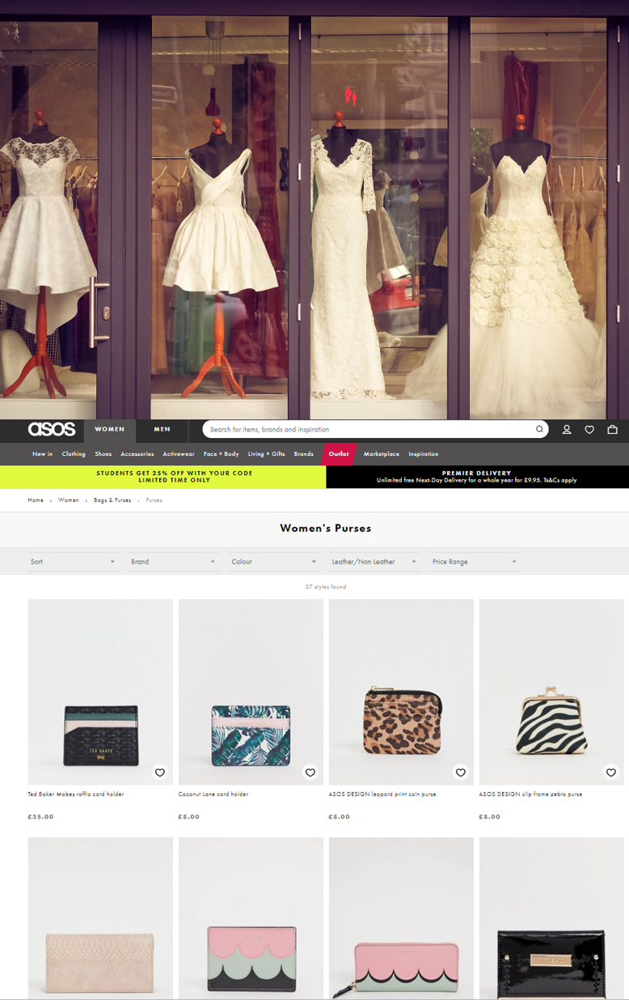
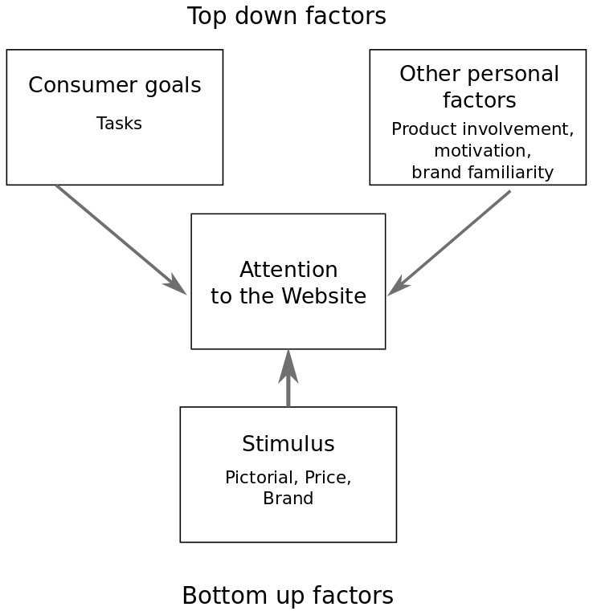

---

class: center, middle, clear

# Introduction


---

# e-commerce and attention

.left-column[ 

```{r, cache=TRUE, echo=FALSE}
knitr::include_graphics("images/UX.png")
```
]

.right-column[

- 2017 Global online retailing: 24.8% <i class="fas fa-arrow-up"></i> and 10.2% <i class="fas fa-chart-pie"></i> total retail sales worldwide.

- **User Experience** (UX) in e-commerce sites is increasingly important.

- **Attention** is both **pre-requirement** for response and an important antecedent of the global UX.

- Consumers' attention is **scarce resource** and the design of the web site should ease attentional processes.

- **Main objective**: understanding **user attention processes** in e-commerce websites.
]


---

# Website attention analysis

.left-column[ 

```{r, cache=TRUE, echo=FALSE}

```
]

.right-column[

- Analysis of **Areas of Interest (AOIs)** in a website (Holzschlag, 1998). 

- **Product area** is the main **marketing information** area (Huizingh, 2000).

- Similar function to a shop window.

- **Information presentation** in this area is critical for success (Flavian, Gurrea and Orus 2002).

- The area most **largely observed** (Cortinas, Cabeza, Chocarro, Villanueva, 2019).
]

---

# Visual Marketing Attention Theory

.pull-left[

- **Top-down factors**: individuals' unique aspect (expectations, objectives, emotions).

- **Bottom-up factors**: characteristics of the stimuli (text, size, colors, shape...). Also called *atmospherics*.

]

.pull-right[

```{r, cache=TRUE, echo=FALSE}

```
<small><i>Adapted from Wedel and Pieters, 2008</i></small>
]

---

# Text vs Image

## Advertising literature: 

- **Illustrations** are **key elements** to capture attention regardless of their size.

- Perception of **image** is **faster** and more **automatic**.

- **Focal attention** and willingness is required for **text processing**.

## Attention to the website literature:

- **Research** on text-image combination in the product area **is reduced**.

- Product image is a **proxy** to the product itself.

- Price and brand are even more important as there is a **lack of information about other attributes**.

- Relative importance may depend on the **stage of the purchase process** and other **top-down factors** (product involvement, relative importance of each attribute...).

---

# Objectives

**1**.	Analyze the **effect of the stimulus**: Is the same attention paid to the image, the price and the brand?

**2**.	Analyze the effect of the **consumers goals**: Does the attention vary when the task is different?

**3**. Analyze the effect of the **website**: Does the attention vary when the category of the product is different?

**4**.	Analyze the relationships between **observed attention processes** and **stated responses**.
