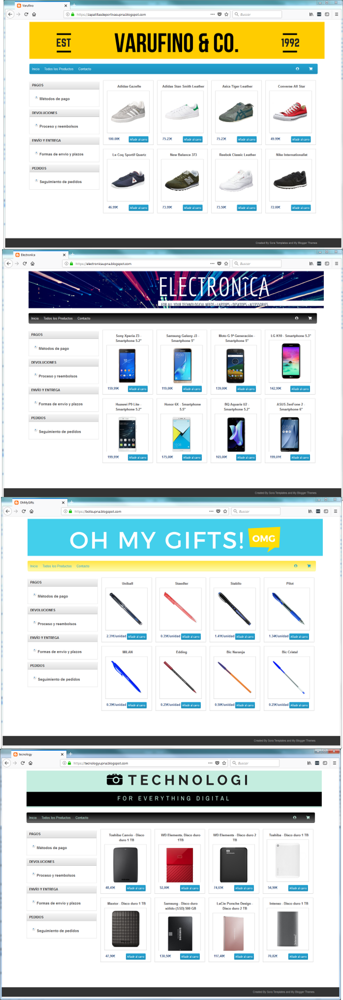
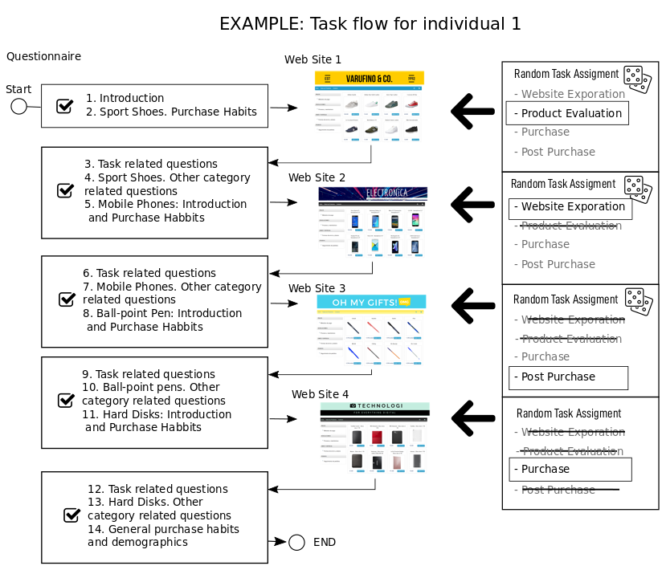

class: center, middle, clear

# Research Design

---

# Subjects and Design

.left-column[ 

```{r, cache=TRUE, echo=FALSE}

```
]

.right-column[ 
- Four **product categories**: sport shoes, mobile phones, ball-point pens, hard disks.

- Four **different task**: 
  - site **exploration**: rate the website overall appeal.
  - product **evaluation**: select the product which most appeals to you.
  - product **purchase**: add option X to the shopping cart.
  - **post-purchase** information search: find out how to track your order.

- **58 university students**.

- Tasks x Store pairs were assigned **randomly**.
]

---

# Measures


## Declarative Measures

- Purchasing **habits** for each category.

- **Task** related questions, category **knowledge, involvement and experience**.

- Evaluation of relative **importance of price, brand and services** in the category.

- General **subject characteristics**.

## Eye tracking measures

- Hardware: **Eye Tribe Tracker** (accuracy 0.5º, spacial resolution of 0.1º, average frame rate 30Hz.).

- **Calibration** before the experiment.

- We compute aggregated **fixations by subject, store and AOI**.


---
class: center

# Experimental procedure


```{r, cache=TRUE, echo=FALSE, out.width="650px"}

```


