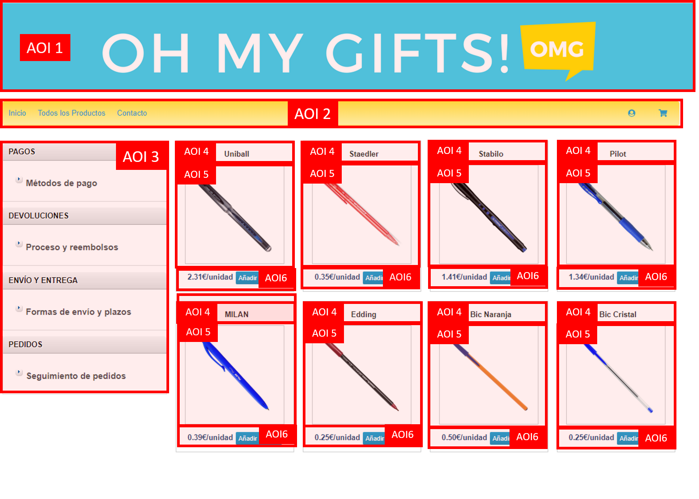
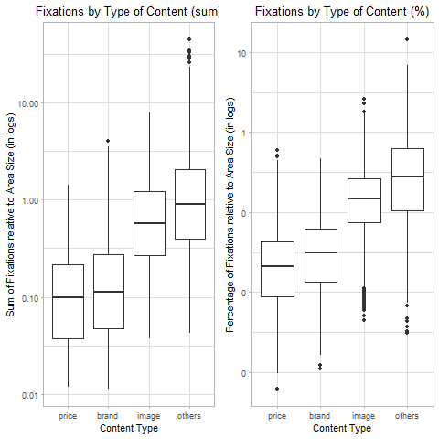
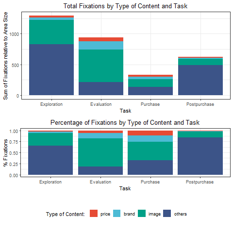
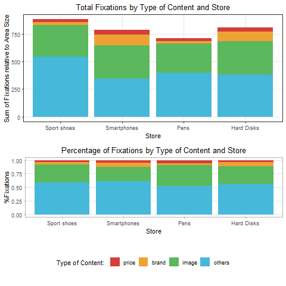
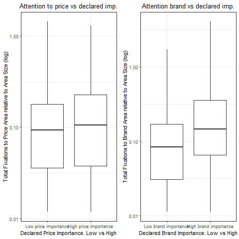

class: center, middle, clear

# Results

---

# Measures

.pull-left[

## Indicators:

- We group fixations in all **AOI4** to compute fixations in the **brand content area**, fixations in **AOI5** to compute **fixations in the image area** and fixations in **AOI6** to compute fixations in **price content area**.

- Other fixations are grouped under the "Other" label (AOI1, AOI2, AOI3).

- Measures are standardized taking into account the **relative size** of each **area**.
]

.pull-right[

## Definition of AOI:


```{r, cache=TRUE, echo=FALSE}


```

]
---

# Attention intensity by area


.pull-left[


```{r, cache=TRUE, echo=FALSE}

```
]

.pull-right[

- **Image** attracts more attention (mean:0.91), followed by **brand** (mean:0.24) and finally **price** (mean:0.16) (Anova test F=717.8 p<0.001).

- Similar results if we **standardized** by **total fixations** of the subject in the task (Anova test F=874.6 p<0.001).


]

---

# Differences by task


.pull-left[
- The **more complex** the task is, more attention is required to fulfill it: website **exploration** and product **evaluation** require much more effort.

- Areas of attention different by task, **product area** in general more important in **product evaluation and purchase task** (other is less important).

- Lower panel: **brand** and **price** are important in purchase related task (**second and third task**).

- **Images** important in all cases.

]

.pull-right[

```{r, cache=TRUE, echo=FALSE}

```

]

---

# Differences by product category

.pull-left[


```{r, cache=TRUE, echo=FALSE}

```
]

.pull-right[

- **Small differences** in total attention **between stores**: sport shoes and hard disk seems to attract greater attention but differences are not significant (F=1.19).

- **Price** is more important in the **ball-point pen** store.

- **Brand** much more important for **smart phones and hard disks**.

- **Image** more important for **sport shoes** and **pens**.

]

---


# Comparison with declarative importance

.pull-left[

- Questionnaire: *When shopping for X online, how do you rate the following in terms of importance?*:
  - Price: Very low (1) - Very high (7)
  -	Brand: Very low (1) - Very high (7)
  
- **Two groups** divided by the **median** value

- **Positive association** between **declared importance and attention intensity**, specially in the case of brand:
  - Those subjects with **high declared importance** for brand content **spent more time** looking at that information.
]

.pull-right[

```{r, cache=TRUE, echo=FALSE}

```

]

---
class: center, middle, clear

# Concluding remarks

---

# Concluding remarks

- We study attention processes to textual and visual information simultaneously considering the effects of:
  - Customer goals.
  - Purchase category.
  - Consumers statements about the importance of product attributes.
  
- **Image** information is as expected the **more prominent** stimulus for all cases.

- The role of **brand and price** information is **dependent** on the task and the category.

- **Declarative measures** show potential to be useful as a proxy in the case of attention to brand. 
